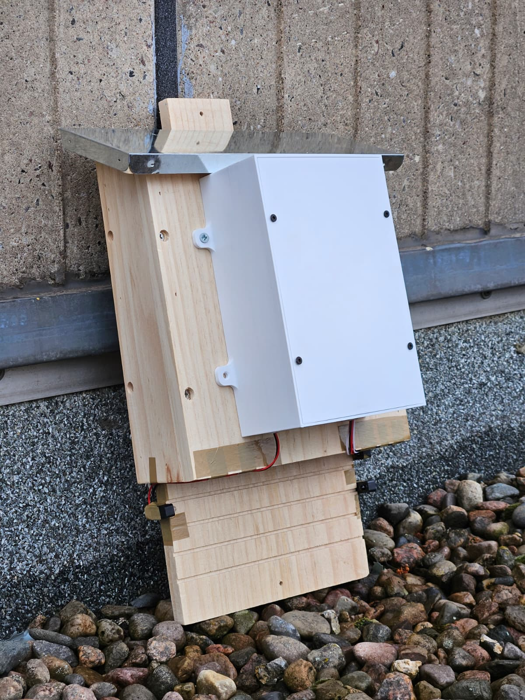
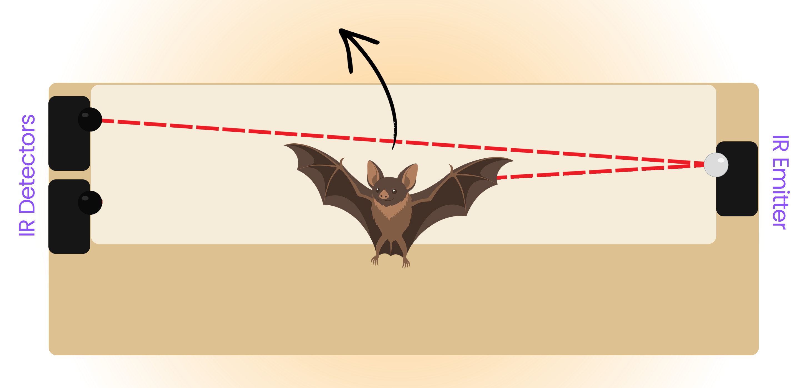
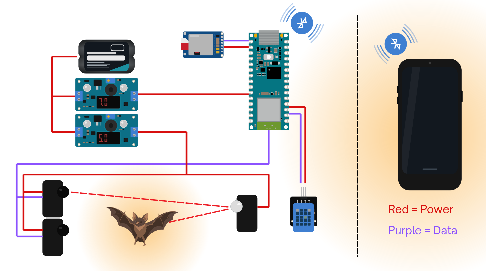
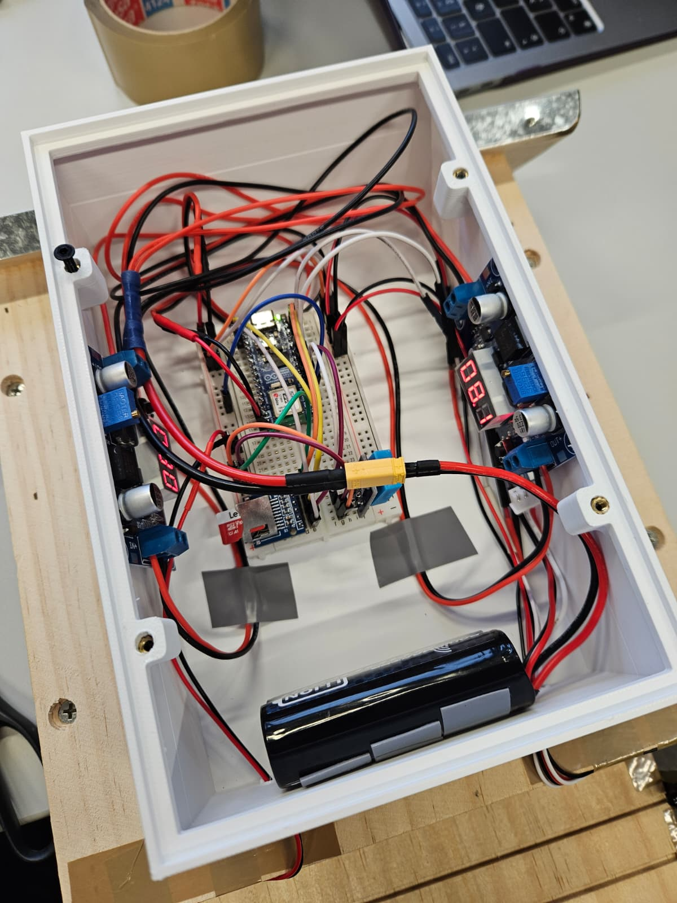
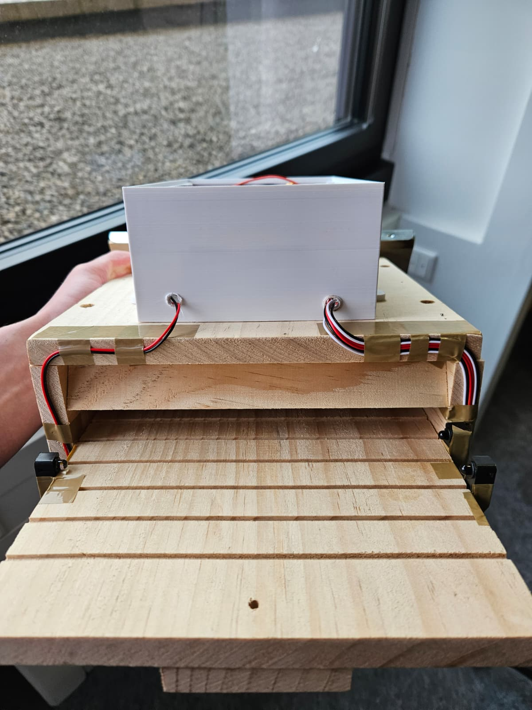

# BatMetrics — Hardware & Firmware

*Open-source, low-cost hardware and firmware for automated, low-disturbance bat activity monitoring.*

[](LICENSE)



## Table of contents

- [Overview](#overview)
- [How it works](#how-it-works)
- [Hardware overview](#hardware-overview)
- [Firmware setup](#firmware-setup)
- [Data & BLE protocol](#data--ble-protocol)
- [Enclosure](#enclosure)
- [Companion app](#companion-app)
- [Limitations](#limitations)
- [License](#license)
- [Acknowledgments](#acknowledgments)

## Overview

BatMetrics is a retrofittable sensor unit for bat boxes. Two infrared beam-break sensors at the box entrance count individual bats entering and leaving, while an onboard temperature and humidity sensor tracks conditions outside the box. Counts and readings are logged to a micro SD card and made available live over Bluetooth Low Energy, so data can be checked and exported without opening the box.

The project aims to make basic bat activity monitoring affordable and accessible to small conservation groups and researchers, in support of UN SDG 15 (Life on Land).

This repository holds the hardware design and Arduino firmware. For the mobile-friendly dashboard that syncs with it, see the [BatMetrics app repository](https://github.com/antoniabuss/bat-metrics-application).

## How it works



Two IR receivers are mounted vertically at the box entrance, opposite a single IR emitter operating at 950 nm (outside the visible range for common bat species). Under normal conditions both beams stay unbroken. When a bat crosses, its body interrupts one beam slightly before the other — the order the beams break in determines direction: sensor-1-first is counted as **in**, sensor-2-first as **out**. If both beams break within the same debounced sample (e.g. two bats passing at once), the event is logged separately as **unknown** rather than guessing a direction.

A short per-beam debounce (15 ms, tuned against real bounce measurements) filters out spurious transitions before they're trusted, and a four-state sequence (`IDLE` → `ARMED_1`/`ARMED_2` → `CLEARING`) prevents a single bat lingering at the entrance from being counted twice.

Temperature and humidity are sampled once at boot and then every 15 minutes. Every confirmed crossing and every sensor reading is written to the SD card immediately, and pushed to any connected BLE client without delay.

## Hardware overview



*Red = power, purple = data.*

The system has three hardware groups:

- **Sensor array** — two IR beam-break receivers and one IR emitter at the box entrance.
- **Microcontroller & storage** — an Arduino Nano ESP32 reads the sensors, drives BLE, and logs to a micro SD card over SPI.
- **Power supply** — a single 2S Li-ion pack feeds two step-down converters (7 V for the Arduino, 5 V for the IR sensors/emitter).

Full bill of materials, wiring tables, and step-by-step build instructions: **[docs/HARDWARE.md](docs/HARDWARE.md)**.

## Firmware setup

### Requirements

- [Arduino IDE](https://www.arduino.cc/en/software) with the **esp32** board package installed (via Boards Manager)
- Board: **Arduino Nano ESP32**
- Library: **DHT11** (the lightweight library exposing `readTemperatureHumidity()` / `setDelay()` / `getErrorString()` — install via Library Manager and confirm it matches this API before flashing, since multiple same-named DHT libraries with different interfaces exist)
- `SPI`, `SD`, `BLEDevice`, `BLEServer`, `BLEUtils`, `BLE2902` — bundled with the ESP32 board package, no separate install needed
- A micro SD card formatted as **FAT32** (32 GB or smaller — larger cards caused issues during development)

### Flashing

1. Clone this repository.
2. Open `26-07-06_integration_v4.ino` in the Arduino IDE.
3. Select **Tools → Board → Arduino Nano ESP32**.
4. Connect the Arduino via USB-C and select the matching **Port**.
5. Verify/compile, then upload.
6. Open the Serial Monitor at **115200 baud** to see live beam states and counts for debugging.

The BLE device name is set in the `BLEDevice::init(...)` call near the top of `setup()` — rename it (e.g. to identify each deployed box) before flashing your own unit.

## Data & BLE protocol

### SD card snapshot

The current counts and latest environmental reading are written to `/COUNTS.CSV` on every event, overwriting the previous snapshot (not an append-only log):

```
count_in,count_out,count_unknown,net,temperature,humidity,uptime_millis
```

`net` is `count_in - count_out`; `count_unknown` counts crossings where a direction couldn't be reliably assigned.

### BLE characteristic

The Arduino advertises as a BLE peripheral under a configurable name (`BatBox-<name>`) with one service/characteristic pair:

| | UUID |
|---|---|
| Service | `12345678-1234-1234-1234-1234567890ab` |
| Characteristic | `abcd1234-1234-1234-1234-1234567890ab` |

The characteristic supports both **read** (current value) and **notify** (pushed on every counted crossing and every temperature/humidity reading), and holds a compact JSON payload:

```json
{"bats": 12, "temp": 21.5, "hum": 63}
```

`bats` is the net count (`count_in - count_out`). A newly connected client receives an immediate update rather than waiting for the next event.

## Enclosure




The electronics are housed in a 3D-printed, two-part enclosure (body + lid) that mounts directly onto a bat box via four screw tabs. The prototype housing is deliberately oversized to simplify assembly — a production version could be considerably smaller — and future iterations should add weatherproofing (e.g. a rubber seal) and dedicated mounts for the internal electronics, which are currently glued in place.

Source files (`.3mf`) for both parts are in [`enclosure/`](enclosure/); we printed ours in PLA with heat-set inserts for the lid screws.

## Companion app

The [BatMetrics app](https://github.com/antoniabuss/bat-metrics-application) is the client-side dashboard used to sync a box, view its readings, and export data as CSV. It connects over Web Bluetooth, which restricts it to Chromium-based browsers (Chrome, Edge) — Firefox and Safari aren't supported.

## Limitations

- **Environmental sensing** — the DHT11 sensor is rated 0–50 °C; winter outdoor deployment would need a sensor rated for sub-zero temperatures.
- **Weather resistance** — neither the enclosure nor the IR components are weatherproofed yet; sealing and potted wire passthroughs are needed for permanent outdoor use.
- **Power supply** — the 2S Li-ion pack performed well in testing but doesn't offer the runtime needed for prolonged unattended deployment; a long-runtime, weather-resistant power solution is future work.
- **Step-down converter noise** — the converters used occasionally emit a high-pitched noise that could potentially disturb bats; quieter alternatives should be evaluated.
- **Counting robustness** — validated reliably under lab conditions with two sensors; real-world conditions may be more challenging, and additional sensors could improve robustness.

The companion app has its own set of limitations (no backend, browser-local storage only) — see its [README](https://github.com/antoniabuss/bat-metrics-application#limitations).

## License

This project is licensed under the [MIT License](LICENSE).

## Acknowledgments

Developed as part of the Digital Innovation Lab at Universität Hamburg.

Issues and pull requests are welcome.
